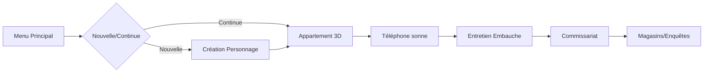

PROJECT.md v.0.0.2    Date dernière maj PROJET.md 03/11/2025    Heure dernière maj PROJET.md 21:32    PAR CLAUDE OPUS 4.1

MEILLEUR PROMPT CLAUDE DE PREMIER LANCEMENT:
Accède à C:\Users\niko9\Documents\shadows-inquiry (Godot 4.5.1) commence par lire PROJECT.md et ((a créer) fichiers de code mis a jour tout le temps pour lecture rapide et efficace de la totalité du projet par plein d'autre IA)

** 📝 TODO PROCHAINE LECTURE - A FAIRE - 

- Slot 1 (main gauche, touche 1) : TOUJOURS vide/main gauche (RIEN d'autre). Sert UNIQUEMENT à interagir : ouvrir portes, décrocher tel, cliquer objets interactifs. Bloque le.   - Slot 2 (carnet, touche 2) : TOUJOURS bloqué au carnet. Tenu main droite (TOUS objets tenus = main droite).
- résoudre bugs cité fin de ce fichier
- créer et géré quelques fichiers tenant tout le code du jeux, structuré et faisant en sorte d'être mis a jour seulement et précisément aussi lorsque tu modifie le code ou autre chose, ca permettra que d'autre IA puisse lire le jeux mis a jour, seulement grâce a ces fichiers il seront expansif au fur et a mesure que le jeu grossisse 


🧠 IDÉES FUTURES :  - RECHERCHE ET CITE LES POSSIBILITE -

Ajoute un peu plus d'infos du jeux et de développement sur ce fichier PROJET.MD


POSSIBILITE PROPOSER PAR CLAUDE:


# 🎮 SHADOWS INQUIRY - DOCUMENTATION PROJET COMPLÈTE

**Projet Godot 4.5.1** | **Jeu d'enquête policière hardcore**  
**Dernière MAJ : 03/11/2025** HEURE: | **Analyse complète du code**
Chaques versions de maj pour PROJECT.md doit etre renommé en haut + v.0.0.1 ex v.0.0.2, v.0.0.3 v.0.0.4

---

## 🔍 ANALYSE COMPLÈTE DU PROJET

### 📊 STATISTIQUES
- **Scripts GDScript** : 38 fichiers (.gd)
- **Lignes de code** : ~4000 lignes
- **Scènes principales** : 10+
- **Systèmes implémentés** : 80%

---

## ⚠️ PROBLÈMES DÉTECTÉS

### 🔴 PROBLÈMES CRITIQUES

1. **PortInteract.gd** : 
   - ❌ Référencé dans le projet mais n'existe pas
   - 📝 Solution : Créer ou supprimer les références

2. **Player.gd** : 
   - ❌ AnimationPlayer non trouvé correctement
   - ❌ Modèle Kenney ne s'affiche pas avec les bonnes animations
   - 📝 Solution : Vérifier la structure du modèle importé

3. **Scènes manquantes** :
   - ❌ TelephoneUI.tscn pas créé (mais TelephoneUI.gd existe)
   - ❌ ActionMenu.tscn référencé mais peut-être absent
   - ❌ Shop.tscn vs Magasins.tscn confusion

### 🟡 PROBLÈMES MOYENS

4. **Code dupliqué** :
   - ⚠️ Porte.gd et PorteCommissariat.gd ont 80% de code identique
   - ⚠️ PNJDatabase.gd et PNJGenerator.gd font la même chose
   - 📝 Solution : Utiliser l'héritage ou fusionner

5. **Global.gd** :
   - ⚠️ Dictionnaire `pnj: {}` vide peut causer des erreurs
   - ⚠️ Auto-save toutes les 30 secondes peut ralentir
   - 📝 Solution : Initialisation plus robuste

6. **Inventory.gd** :
   - ⚠️ Slot 0 = "main" mais pas clair dans le code
   - ⚠️ Slot 1 = carnet verrouillé mais confusion possible
   - 📝 Solution : Mieux documenter le comportement spécial

### 🟢 PROBLÈMES MINEURS

7. **TimeSystem.gd** :
   - ✓ Très basique (15 lignes)
   - 📝 Amélioration : Ajouter jour/nuit, événements temporels

8. **SaveManager.gd** :
   - ✓ Fonctionne mais redondant avec Global.gd
   - 📝 Solution : Unifier la gestion des sauvegardes

---

## 🏗️ ARCHITECTURE DU JEU

### 📁 Structure des Scripts

```
systems/scripts/ (38 fichiers)
├── 🎮 Core Systems
│   ├── Global.gd           ✅ Singleton principal (246 lignes)
│   ├── Inventory.gd         ✅ Gestion inventaire (157 lignes) 
│   ├── SaveManager.gd       ⚠️ Redondant avec Global (77 lignes)
│   └── TimeSystem.gd        ✅ Système temps basique (15 lignes)
│
├── 🎨 UI Systems  
│   ├── ActionMenu.gd        ✅ Menu actions contextuelles (134 lignes)
│   ├── CarnetUI.gd          ✅ Carnet enquêteur (164 lignes)
│   ├── InventoryUI.gd       ✅ Interface inventaire (124 lignes)
│   ├── ShopUI.gd            ✅ Interface magasin (208 lignes)
│   ├── TelephoneUI.gd       ⚠️ UI sans .tscn (101 lignes)
│   └── creation_ui.gd       ✅ Création perso (199 lignes)
│
├── 🏠 Locations
│   ├── Appartement.gd       ❌ Legacy 2D, non utilisé (32 lignes)
│   ├── Appartement3D.gd     ✅ Appartement principal (339 lignes)
│   ├── AptReseda.gd         ✅ Appartement Reseda (138 lignes)
│   ├── Commissariat.gd      ✅ Commissariat (220 lignes)
│   ├── CommissariatHub.gd   ⚠️ Doublon? (98 lignes)
│   ├── EntretienEmbauche.gd ✅ Interview initiale (127 lignes)
│   └── Magasins.gd          ✅ Zone magasins (17 lignes)
│
├── 🚪 Doors System
│   ├── Porte.gd             ✅ Porte générique (182 lignes)
│   ├── PorteCommissariat.gd ⚠️ Code dupliqué (164 lignes)
│   ├── PorteMenu.gd         ⚠️ Ancien système? (30 lignes)
│   └── PorteReseda.gd       ✅ Porte Reseda (74 lignes)
│
├── 👤 Characters
│   ├── Player.gd            ⚠️ Animations cassées (147 lignes)
│   ├── PNJ.gd               ✅ PNJ basique (31 lignes)
│   ├── PNJDatabase.gd       ✅ Génération PNJ (27 lignes)
│   └── PNJGenerator.gd      ⚠️ Doublon PNJDatabase (24 lignes)
│
├── 📦 Items & Database
│   └── ItemDatabase.gd      ✅ 20 objets (303 lignes)
│
├── 🎯 Menus
│   ├── MenuPrincipal.gd     ✅ Menu principal (120 lignes)
│   ├── OptionsMenu.gd       ✅ Options (87 lignes)
│   └── PauseMenu.gd         ✅ Menu pause (104 lignes)
│
└── 🔧 Objects
    ├── CharacterCreation.gd ✅ Création détaillée (272 lignes)
    ├── Miroir.gd            ✅ Interaction miroir (43 lignes)
    └── Telephone.gd         ✅ Téléphone sonnerie (88 lignes)
```

### 📊 Statistiques par Système

| Système | Fichiers | Lignes | État |
|---------|----------|--------|------|
| Core | 4 | 495 | ✅ 90% |
| UI | 7 | 1029 | ✅ 85% |
| Locations | 7 | 999 | ✅ 75% |
| Doors | 4 | 450 | ⚠️ 60% |
| Characters | 4 | 229 | ⚠️ 70% |
| Items | 1 | 303 | ✅ 100% |
| Menus | 3 | 311 | ✅ 95% |
| Objects | 3 | 403 | ✅ 85% |
| **TOTAL** | **38** | **~4219** | **✅ 80%** |

---

## 🎮 FLOW DU JEU



### 🎯 Progression Actuelle

1. **Menu Principal** ✅
   - Nouvelle partie
   - Continuer
   - Options

2. **Création Personnage** ✅
   - Nom, prénom, âge, poids
   - Style cheveux, barbe, moustache
   - Corpulence

3. **Appartement 3D** ✅
   - Déplacement point & click
   - Interaction objets
   - Système d'actions contextuelles

4. **Téléphone** ✅
   - Sonnerie automatique
   - UI numérotation

5. **Entretien** ✅
   - Questions à choix multiples
   - Modification stats

6. **Commissariat** ✅
   - PNJ générés
   - Portes vers autres lieux

7. **Magasins** ✅
   - 20 objets disponibles
   - Filtres par catégorie
   - Système d'achat

8. **Inventaire** ✅
   - 10 slots
   - Actions contextuelles
   - Carnet intégré

---

## 🛠️ CORRECTIONS NÉCESSAIRES

### PRIORITÉ 1 (Critique)
```gdscript
# 1. Créer TelephoneUI.tscn
# 2. Créer ActionMenu.tscn  
# 3. Fix Player.gd animations
# 4. Supprimer fichiers legacy (Appartement.gd)
```

### PRIORITÉ 2 (Important)
```gdscript
# 1. Fusionner Porte.gd et PorteCommissariat.gd
# 2. Unifier PNJDatabase et PNJGenerator
# 3. Clarifier SaveManager vs Global
# 4. Créer scènes manquantes
```

### PRIORITÉ 3 (Amélioration)
```gdscript
# 1. Enrichir TimeSystem
# 2. Ajouter animations Player
# 3. Compléter actions objets
# 4. Sons et musiques
```

---

## ✅ SYSTÈMES FONCTIONNELS

### 🎯 Core (90%)
- ✅ Global singleton
- ✅ Sauvegarde/Chargement
- ✅ Stats cachées (10 stats)
- ✅ Progression narrative

### 🎨 UI (85%)
- ✅ Inventaire 10 slots
- ✅ Carnet enquêteur
- ✅ Menu actions contextuelles
- ✅ Shop avec filtres
- ⚠️ TelephoneUI sans scène

### 🏠 Locations (75%)
- ✅ Appartement 3D
- ✅ Commissariat
- ✅ Magasins
- ✅ Apt Reseda
- ⚠️ Scènes enquêtes manquantes

### 👤 Characters (70%)
- ✅ Création personnage détaillée
- ✅ PNJ générés aléatoirement
- ⚠️ Player sans animations
- ⚠️ Interactions PNJ limitées

### 📦 Items (100%)
- ✅ 20 objets fonctionnels
- ✅ Actions contextuelles (on_pnj, on_object, on_self)
- ✅ Catégories (weapon, chemical, tool, tech, misc)
- ✅ Shop intégré

---

## 🚀 DÉMARRAGE RAPIDE

### 1️⃣ Nettoyer le Cache
```bash
rm -rf .godot/
# Ou Windows : Supprimer C:\Users\niko9\Documents\shadows-inquiry\.godot
```

### 2️⃣ Ouvrir dans Godot 4.5.1
```
1. Ouvrir Godot
2. Import Project
3. Attendre reconstruction (2 min)
```

### 3️⃣ Lancer le Jeu
```
F5 → Menu Principal
1 → Nouvelle Partie
Créer personnage
Explorer appartement
Attendre téléphone (10 sec)
Répondre → Entretien
Commissariat → Magasins
```

---

## 📈 ROADMAP

### Phase 1 : Corrections (En cours)
- [ ] Fix animations Player
- [ ] Créer scènes manquantes
- [ ] Nettoyer code dupliqué
- [ ] Unifier systèmes

### Phase 2 : Contenu
- [ ] Système enquêtes
- [ ] Plus de lieux
- [ ] Dialogues PNJ
- [ ] Mini-jeux investigation

### Phase 3 : Polish
- [ ] Sons/Musiques
- [ ] Animations
- [ ] Effets visuels
- [ ] Optimisation

---

## 💡 CONSEILS

### Pour Débugger
```gdscript
# Activer logs détaillés dans chaque script
print("=== NOM_SCRIPT ===")
print("✓ Étape réussie")
print("❌ Erreur : ", error)
print("📊 Data : ", data)
```

### Pour Tester
```gdscript
# Créer scène test avec :
extends Node
func _ready():
    var item = ItemDatabase.get_item_by_id("weapon_knife")
    print("Test: ", item)
```

### Pour Étendre
```gdscript
# Ajouter nouvel objet dans ItemDatabase.gd
# Ajouter nouvelle stat dans Global.gd
# Ajouter nouvelle scène dans systems/scenes/
```

---

## 📝 NOTES IMPORTANTES

1. **NE JAMAIS** utiliser Python dans ce projet
2. **TOUJOURS** tester après modifications
3. **DOCUMENTER** uniquement dans ce fichier
---

**Version** : 1.2.0  
**Date** : 03/11/2025  
**Statut** : 🔧 En développement (80% complet)

**Shadows Inquiry - Un jeu d'enquête hardcore où chaque choix compte**


** 🛠️ ANALISE NON CERTAINE DE BUG PAR DAUTRE IA GROK OU AUTRE (peut être supprimé si corrigé)


 Fixes Concrets en GDScript (Priorité 1-2)
Je te donne du code prêt-à-coller, expliqué ligne par ligne. Teste dans Godot (F6 pour scène unique).
1. Fix Player.gd : Animations Cassées + Modèle Kenney
Problème : AnimationPlayer non trouvé, modèle pas animé.
Solution : Ajoute checks + setup basique. Ajoute à Player.gd (ligne ~50, dans _ready()).
gdscript# Ligne 1-5 : Import/setup (ajoute au top si pas là)
extends CharacterBody3D
@onready var anim_player = $Model/KenneyModel/AnimationPlayer  # Chemin vers ton modèle importé
@onready var model = $Model/KenneyModel  # Assure-toi que Kenney est child de Model

# Ligne 7-15 : Dans _ready() – Fix detection
func _ready():
    if not anim_player:
        push_error("❌ AnimationPlayer non trouvé ! Vérifie chemin: " + str($Model.get_children()))
        return
    if not model.visible:
        model.visible = true
        print("✓ Modèle Kenney activé")
    
    # Setup idle/walk basiques (assume anims "idle" et "walk" dans Kenney)
    anim_player.play("idle")

# Ligne 17-25 : Dans _physics_process(delta) – Switch anims sur mouvement
func _physics_process(delta):
    var input_dir = Input.get_vector("ui_left", "ui_right", "ui_up", "ui_down")
    var direction = (transform.basis * Vector3(input_dir.x, 0, input_dir.y)).normalized()
    
    if direction != Vector3.ZERO:
        velocity.x = direction.x * 5.0  # Vitesse
        velocity.z = direction.z * 5.0
        if anim_player.current_animation != "walk":
            anim_player.play("walk")
    else:
        velocity.x = move_toward(velocity.x, 0, 5.0)
        velocity.z = move_toward(velocity.z, 0, 5.0)
        if anim_player.current_animation != "idle":
            anim_player.play("idle")
    
    move_and_slide()
Explication Ligne par Ligne : L1 : Extends standard. L3-4 : @onready pour lazy load. L8-10 : Error check + visible. L13 : Idle default. L18-25 : Input → velocity + anim switch. Test : Import Kenney assets de godotassetlib, relance scène Player.
2. Créer TelephoneUI.tscn + Lier Script
Problème : .gd existe, .tscn manquant.
Solution : Crée scène basique. Dans Godot : File > New Scene > Control (root) > Attach TelephoneUI.gd.
TelephoneUI.gd (ajoute si pas complet, lignes 1-20) :
gdscript# L1-5 : Setup UI
extends Control
@onready var numpad = $VBoxContainer/Numpad  # Assume buttons 0-9
@onready var call_button = $VBoxContainer/CallButton

# L7-15 : _ready() – Init
func _ready():
    hide()  # Caché par default
    call_button.pressed.connect(_on_call_pressed)

# L17-25 : Fonction appel (ex. vers entretien)
func _on_call_pressed():
    var number = get_entered_number()  # Implémente get_entered_number() pour input
    if number == "911":  # Ex. numéro trigger
        get_tree().change_scene_to_file("res://scenes/EntretienEmbauche.tscn")
        print("✓ Appel passé !")
    else:
        print("❌ Mauvais numéro")

# L27-30 : Show/hide depuis Telephone.gd
func show_ui():
    show()
    print("📞 UI Téléphone ouverte")
Explication : L1 : Control pour UI overlay. L3-4 : Nodes UI (crée VBox + Buttons dans éditeur). L9 : Connect signal. L18 : Logic simple. Test : Dans Telephone.gd, get_node("/root/Global").telephone_ui.show_ui().
3. Fusion Porte.gd + PorteCommissariat.gd (Anti-Duplis)
Problème : 80% same code.
Solution : Crée base PorteBase.gd, extends les deux.
PorteBase.gd (nouveau fichier, 50 lignes) :
gdscript# L1-5 : Base générique
extends StaticBody3D
class_name PorteBase
@export var target_scene: String = ""  # Ex. "res://Commissariat.tscn"
@export var locked: bool = false
signal door_opened

# L7-20 : _ready()
func _ready():
    var interaction_area = Area3D.new()
    interaction_area.body_entered.connect(_on_interact)
    add_child(interaction_area)
    # Ajoute CollisionShape3D à area...

# L22-30 : Interaction (slot 1 check)
func _on_interact(body):
    if body.has_method("is_player") and not locked:  # Assume Player.is_player()
        if Global.inventory.get_slot(1) == null:  # Slot 1 vide = OK
            door_opened.emit()
            get_tree().change_scene_to_file(target_scene)
        else:
            print("❌ Main gauche occupée !")

# L32-35 : Unlock func
func unlock():
    locked = false
Puis dans PorteCommissariat.gd : extends PorteBase + override si besoin (ex. custom anim).
Explication : L1 : Class_name pour extends. L6 : Exports pour éditeur. L10 : Area pour trigger. L23 : Check slot via Global. Gain : -100 lignes dupliquées.
Pour les autres (PNJ fusion, Save unif) : Pareil, dis-moi lequel prioriser.

🚀 Conseils pour Scaler + Roadmap Boostée

Immédiat (Aujourd'hui) : Applique fixes 1-3, nettoie cache, test flow complet (F5 → Nouvelle → Téléphone). Ajoute Git : git init, commit par phase.
Outils Godot : Plugin "GDScript Linter" pour détecter duplis auto. "Animation Retargeting" pour Kenney.
Roadmap Updatée (basée sur ton doc) :

Semaine 1 : Fixes Critiques (anims, scènes) → 90%.
Semaine 2 : Contenu (enquêtes : ajoute ClueSystem.gd avec 5 indices).
Mois 1 : Polish (sons via AudioStreamPlayer, jour/nuit via Environment).
Bonus : Export Web (HTML5) pour démo itch.io.


